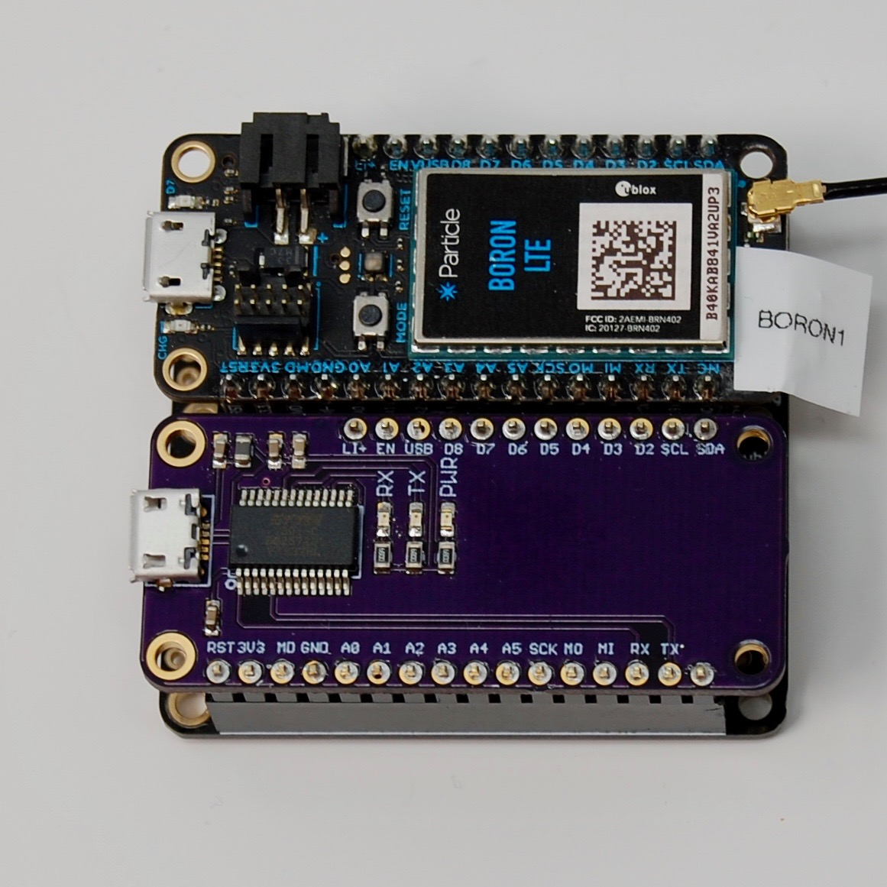
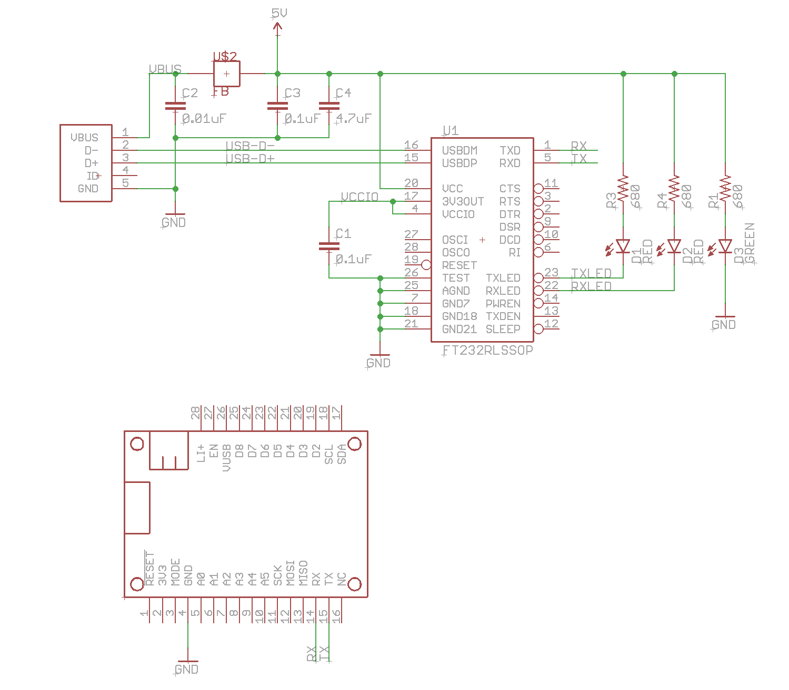
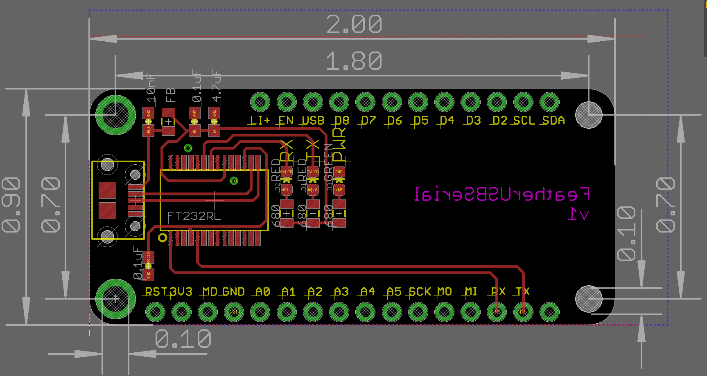

# Feather USB Serial
*FT232 USB serial port connection to RX/TX (Serial1) in an Adafruit FeatherWing form-factor*

This simple board allows easy access to Serial1, typically for debugging purposes. You insert it in a [Adafruit FeatherWing Doubler](https://www.adafruit.com/product/2890) or [Tripler](https://www.adafruit.com/product/3417) along with your device.

While it's no big deal to attach a [FT232 breakout](https://www.sparkfun.com/products/12731), the FeatherWing is nice and neat with no dangling wires.

This post has all of the information you need to build your own. It's not available for purchase pre-built.

## What You Need

This is a somewhat advanced project mainly because the FT232 has a lot of pins, very close together. It's probably not practical to solder by hand, so you'll need a SMD reflow oven to do it effectively.

- Circuit boards (I order them from [OshPark](https://oshpark.com))
- Stencil (this board can be assembled without one, but I order them from [OshStencils](https://oshstencils.com))
- Solder paste
- Reflow oven (the inexpensive [T962](https://www.amazon.com/dp/B01LZYEF90/ref=dp_prsubs_1) works fine)
- Soldering iron (for the header pins)
- Regular solder

In the eagle directory are the .brd and .sch files for Eagle CAD. One of the reasons I like OshPark is that they accept the .brd files directly, instead of having to generate Gerber files. It costs US$9.00 with free shipping for 3 FeatherWing boards.

There's also a .lbr file with all of the parts in this project.

## BOM (Bill of Materials)

| Quantity | Item | Example |
| --- | --- | --- |
| 1 | 0.01 uF capacitor 0603 | [Murata GCM188R72A103KA37J](https://www.digikey.com/product-detail/en/murata-electronics-north-america/GCM188R72A103KA37J/490-8028-1-ND/4380313) |
| 2 | 0.1 uF capacitor 0603 | [Murata GRM188R71C104KA01D](https://www.digikey.com/product-detail/en/murata-electronics-north-america/GRM188R71C104KA01D/490-1532-1-ND/587771) |
| 1 | 4.7 uF capacitor 0603 | [Murata GRM188R60J475KE19J](https://www.digikey.com/product-detail/en/murata-electronics-north-america/GRM188R60J475KE19J/490-6407-1-ND/3845604) |
| 1 | Ferrite Bead 40 ohm 0805 | [Laird MI0805K400R-10](https://www.digikey.com/products/en/filters/ferrite-beads-and-chips/841?k=MI0805K400R&k=&pkeyword=MI0805K400R&sv=0&pv7=2&pv1989=0&sf=0&quantity=&ColumnSort=0&page=1&pageSize=25) |
| 3 | 680 ohm resistor 1/8w 0805 | [Panasonic ERJ-6GEYJ681V](https://www.digikey.com/product-detail/en/panasonic-electronic-components/ERJ-6GEYJ681V/P680ACT-ND/90033) | 
| 2 | LED red 5mA 0603 | [Lite-On LTST-C193KRKT-5A](https://www.digikey.com/product-detail/en/lite-on-inc/LTST-C193KRKT-5A/160-1830-1-ND/2356251) |
| 1 | LED green 5mA 0603 | [Lite-On LTST-C193KGKT-5A](https://www.digikey.com/product-detail/en/lite-on-inc/LTST-C193KGKT-5A/160-1828-1-ND/2356247) |
| 1 | FT232RL USB serial | [FTDI FT232RL](https://www.digikey.com/product-detail/en/ftdi-future-technology-devices-international-ltd/FT232RL-REEL/768-1007-1-ND/1836402) |
| 1 | Micro USB B SMD | [Amphenol FCI 10118194-0001LF](https://www.digikey.com/products/en?keywords=609-4618-1-nd) |
| | Male header pins 0.1" | [Sullins PRPC040SAAN-RC](https://www.digikey.com/product-detail/en/PRPC040SAAN-RC/S1011EC-40-ND/2775214) |